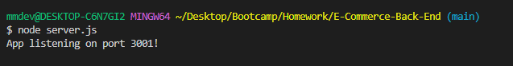

# E-Commerce-Back-End

## Description

Internet retail, also known as e-commerce, is the largest sector of the electronics industry, generating an estimated $29 trillion in 2019. E-commerce platforms like Shopify and WooCommerce provide a suite of services to businesses of all sizes. Due to their prevalence, understanding the fundamental architecture of these platforms will benefit you as a full-stack web developer.

This application is the back-end for an e-commerce site.

## Table of Contents (Optional)

If your README is long, add a table of contents to make it easy for users to find what they need.

- [Installation](#installation)
- [User-Story](#user-story)
- [Features](#features)
- [License](#license)
- [Demo](#demo)
- [Questions](#questions)

## Installation

1) In order to run this application, first run "npi install" in order to install required packages. 

2) Run "source schema.sql; in SQL

3) Next, the user will run "npm run seed" in order to seed data to the database so the user can test routes. 

Last, the user will run "node server.js" in order to sync the Sequelize models to the MySQL databsae on server start.

## User-Story

AS A manager at an internet retail company
I WANT a back end for my e-commerce website that uses the latest technologies
SO THAT my company can compete with other e-commerce companies

## Features

Included features in this application are listed below.

- Express.js
- Sequelize
- MySQL Database
- Insomnia

## License

ISC License: A permissive license lets people do anything with your code with proper attribution and without warranty. The ISC license is functionally equivalent to the BSD 2-Clause and MIT licenses, removing some language that is no longer necessary.

https://choosealicense.com/licenses/isc/#

## Demo

Walkthrough video that shows the POST, PUT, and DELETE routes for products and tags being tested in Insomnia.

- Creating the schema from the MySQL shell, seeding the database from the command line, and starting the application's server
    
    Link: https://drive.google.com/file/d/1UZRCdrcRxVFVNTB3MwErD3OM5wYBkuMV/view
    
- Demonstrating GET routes for all categories, all products, and all tags being tested in Insomnia.

    Link: 

- Demonstrating GET routes for a single category, a single product, and a single tag being tested in Insomnia.

    Link: 

- Demonstrating POST, PUT, and DELETE routes for categories, products, and tags being tested in Insomnia.

    Link: 

## Questions

For any questions, contact Melissa Deven at mmdeven@gmail.com or visit GitHub profile at https://github.com/Deven1991.
